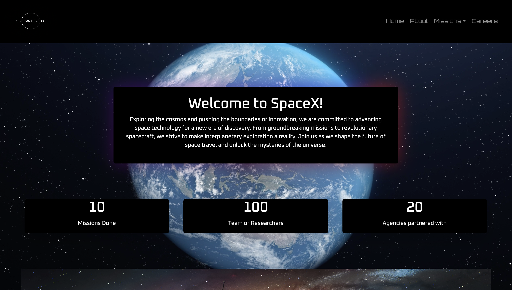
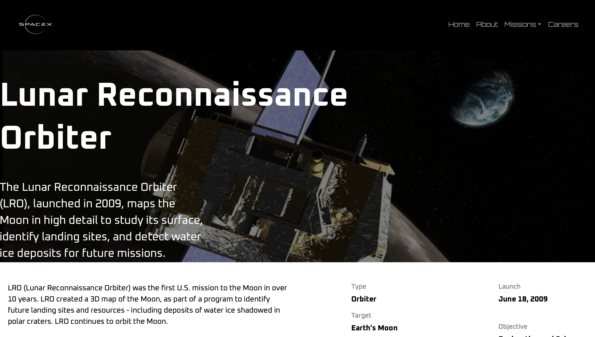
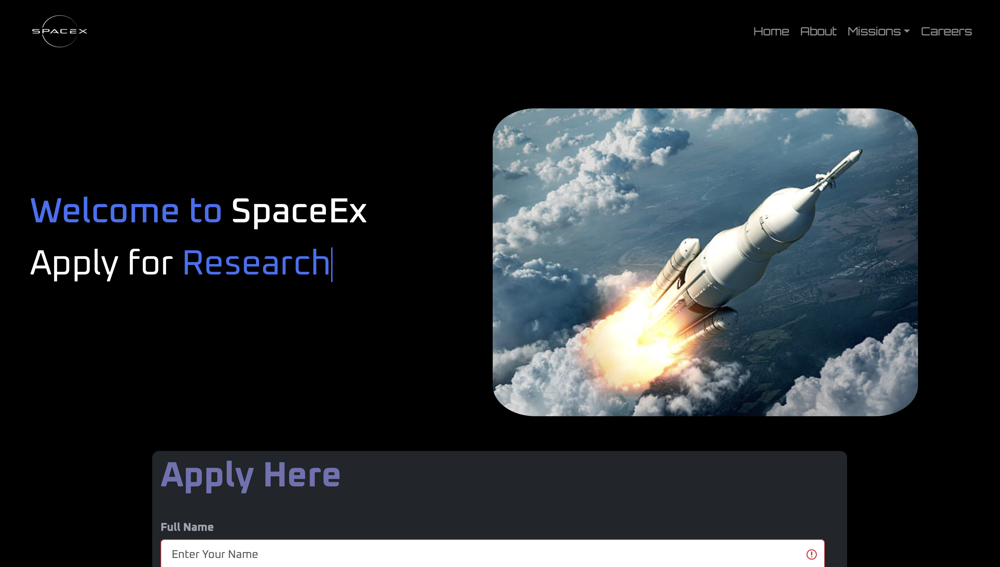

# 🚀 SpaceExploration

**SpaceExploration** is a web-based platform that offers an immersive experience into space missions, telescopes, and celestial discoveries. Built with HTML, CSS, JavaScript, PHP, and MySQL, it aims to educate and engage users in the wonders of the universe.

---

## 🌟 Demo

> 🔗 [Live Demo](https://abp334.github.io/SpaceExploration/)  

---

## 🌌 Features

- 🌍 **Explore Missions**: Detailed mission pages like `mars.html`, `lro.html`, and `mannedmission.html`.
- 🛰️ **Image Carousel**: Beautiful rotating gallery in `caraouselimg.html`.
- 👩‍🚀 **Careers in Space**: Guidance and insights into space-related career paths.
- 🔭 **Telescope Knowledge**: Learn how telescopes help us uncover the cosmos.
- 📱 **Responsive Design**: Mobile-friendly experience for all users.
- 🧠 **Backend with MySQL & PHP**: Handles data like contact forms or application info.

---

## 🖼️ Screenshots

| Home Page | Mission Page | Careers Page |
|----------|---------------|---------------|
|  |  |  |


---

## 🛠️ Tech Stack

- **Frontend**: HTML5, CSS3, JavaScript
- **Backend**: PHP
- **Database**: MySQL
- **Version Control**: Git, GitHub

---

## 📁 Project Structure
<pre>
```
SpaceExploration/
├── about.css
├── about.html
├── careers.css
├── careers.html
├── careers.js
├── caraouselimg.html
├── footer.css
├── footer.html
├── index.html
├── index.js
├── lro.html
├── mannedmission.html
├── mars.html
├── mission.css
├── save.php
├── SpaceExploration.sql
├── style.css
├── telescope.html
├── .vscode/
│   └── settings.json
├── media/
│   └── (images/screenshots here)
```
</pre>

---

## 📄 License

This project is licensed under the **MIT License** — feel free to use, modify, or build upon it.

---

## 🙋‍♂️ Author

**[abp334](https://github.com/abp334)**  
Feel free to connect or reach out if you find this project interesting!

---

## 📝 Acknowledgements

- NASA and ISRO for public space mission data and inspiration.
- Free image sources and design inspiration from the space enthusiast community.

---

